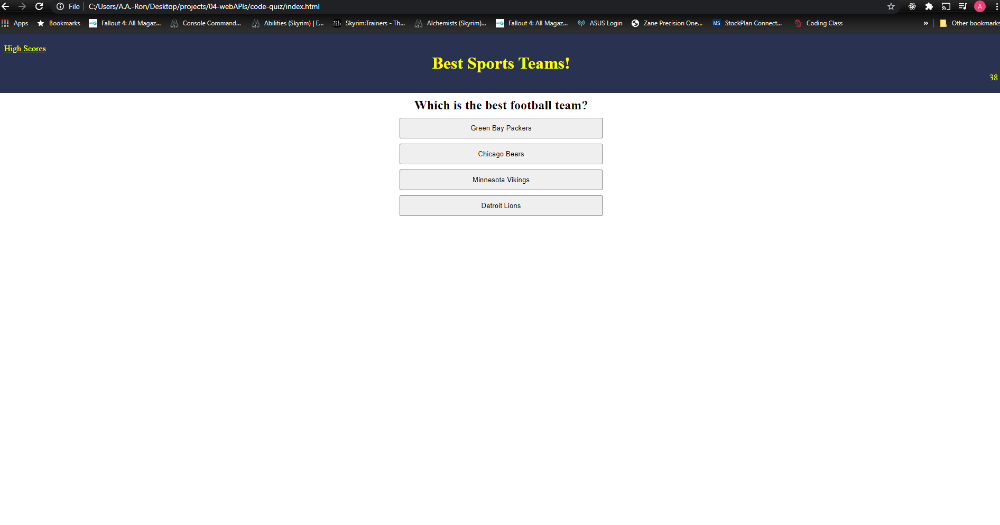

# code-quiz

This project is a fun, brief quiz highlighting America's best sports teams.  There is no bias whatsoever in determining which teams are the best.

// # 04 Web APIs: Code Quiz
// As you proceed in your career as a web developer, you will probably be asked to complete a coding assessment, which is typically a combination of multiple - choice questions and interactive challenges.Build a timed code quiz with multiple - choice questions.This app will run in the browser and feature dynamically updated HTML and CSS powered by your JavaScript code.It will also feature a clean and polished user interface and be responsive, ensuring that it adapts to multiple screen sizes.

// WHEN I click the start button
    // Connect button from html here
    // function to start quiz
    // high score- permenant or final screen 
    // countdown timer
        // 1. countdown
        // 2. Stop the quiz
        // 3. Lose time

// THEN a timer starts and I am presented with a question

// WHEN I answer a question
    // Add 3 questions are multiple-choice
    // array with a var for the correct answer

// THEN I am presented with another question
    // ideas: funtion and return
    // switch
    // double array var codequestion = {question; answer} 
            // {
            //     question: "Commonly used data types do NOT inclue:",
            //         answers: {
            //         1: "strings",
            //             2: "booleans",
            //                 3: "alerts",
            //                     4: "numbers",
            //      },
            //     rightAnswer: "3"
            // },
        // connect button to correct answer
    // If question is correct
        //add event listener to check button- goes to next question 
        // feedback "Correct"

// WHEN I answer a question incorrectly
    // time is subtracted from the clock 
    // feedback "Wrong"
    // if !== deduct time x from timer
    // *optional: if time is less than zero add if (time < 0)

// THEN time is subtracted from the clock
    // deduct x sec from clock 
    // move to next question
    // Out of time .. end quiz

// WHEN all questions are answered or the timer reaches  0
    // Display: "Quiz Complete"
    // Display Score
    // Add place to enter intials 
    // Add Submit button
    // Add "Try Again" Button

// THEN I can save my initials and score
     //Connect to local stoarge
     //get user initials
     // commit user initials & high score
     // Display all high scores